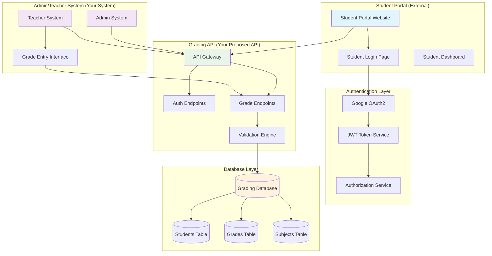
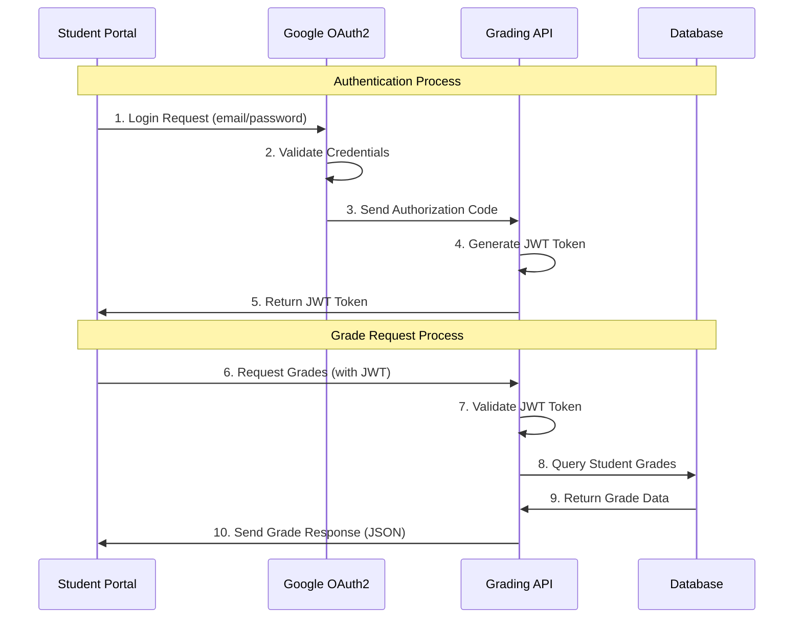
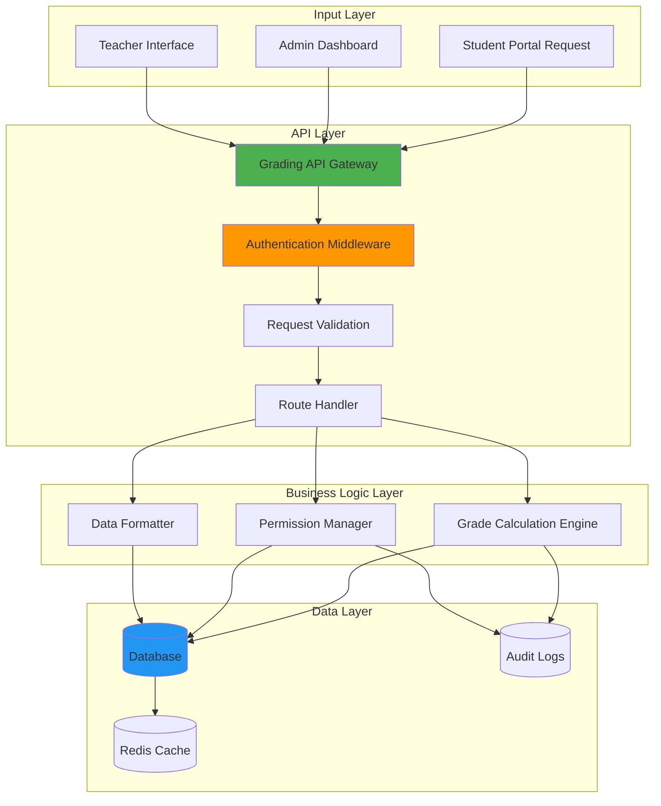
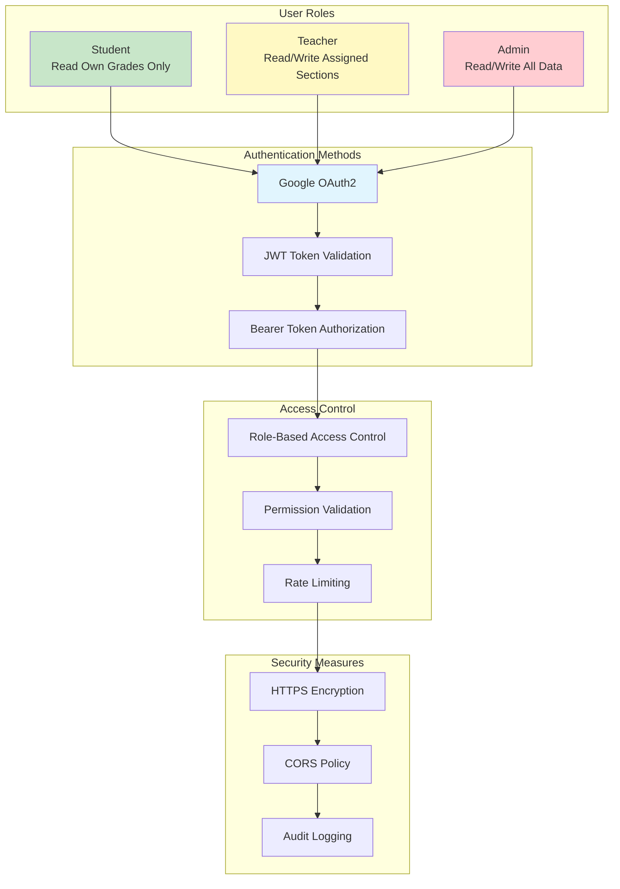

# Grading System API Structure Diagram

## System Architecture Flow



## Authentication Flow Sequence



## API Endpoints Structure

```mermaid
graph LR
    subgraph "Authentication Endpoints"
        A1[POST /auth/token<br/>Login & Get JWT]
        A2[POST /auth/refresh<br/>Refresh Token]
    end
    
    subgraph "Grade Management Endpoints"
        G1[GET /students/{id}/grades<br/>Get Student Grades]
        G2[POST /students/{id}/grades<br/>Add New Grade]
        G3[PUT /students/{id}/grades/{gradeId}<br/>Update Grade]
        G4[DELETE /students/{id}/grades/{gradeId}<br/>Delete Grade]
    end
    
    subgraph "Section Management"
        S1[GET /sections/{id}/grades<br/>Get Section Grades]
        S2[POST /sections/{id}/grades/batch<br/>Batch Grade Input]
    end
    
    subgraph "Utility Endpoints"
        U1[GET /students/{id}/grades/summary<br/>Grade Summary]
        U2[GET /students/{id}/grades/transcript<br/>Official Transcript]
        U3[GET /academic-periods<br/>Available Periods]
        U4[GET /subjects<br/>Subject List]
    end
    
    style A1 fill:#ffcdd2
    style A2 fill:#ffcdd2
    style G1 fill:#c8e6c9
    style G2 fill:#fff9c4
    style G3 fill:#fff9c4
    style G4 fill:#ffcdd2
```

## Data Flow Architecture



## Request/Response Data Structure

```mermaid
graph TB
    subgraph "API Request Structure"
        REQ[HTTP Request]
        METHOD[Method: GET/POST/PUT/DELETE]
        URL[URL: /students/{id}/grades]
        HEADERS[Headers: Authorization Bearer JWT]
        PARAMS[Query Params: sy, semester, yearLevel, section]
        BODY[Request Body: Grade Data (POST/PUT only)]
    end
    
    subgraph "API Response Structure"
        RESP[HTTP Response]
        STATUS[Status Code: 200, 400, 401, 404, 500]
        RESPHEADERS[Response Headers: Content-Type, Cache-Control]
        RESPBODY[Response Body: JSON Data]
    end
    
    subgraph "JSON Response Format"
        JSON[JSON Structure]
        STAT[status: success/error]
        DATA[data: Grade Information]
        META[metadata: Timestamp, API Version]
        ERROR[error: Error Details (if failed)]
    end
    
    REQ --> METHOD
    REQ --> URL
    REQ --> HEADERS
    REQ --> PARAMS
    REQ --> BODY
    
    RESP --> STATUS
    RESP --> RESPHEADERS
    RESP --> RESPBODY
    
    RESPBODY --> JSON
    JSON --> STAT
    JSON --> DATA
    JSON --> META
    JSON --> ERROR
    
    style REQ fill:#e3f2fd
    style RESP fill:#e8f5e8
    style JSON fill:#fff3e0
```

## Security & Access Control



## Integration Points

```mermaid
graph LR
    subgraph "External Systems"
        SP[Student Portal<br/>React/Vue/Angular]
        LMS[Learning Management System]
        SIS[Student Information System]
        MOBILE[Mobile App]
    end
    
    subgraph "Your Grading API"
        API[Grading API Gateway]
        ENDPOINTS[REST Endpoints]
        WEBHOOK[Webhooks (Future)]
    end
    
    subgraph "Internal Systems"
        ADMIN[Admin Dashboard]
        TEACHER[Teacher Interface]
        REPORTS[Report Generator]
        BACKUP[Backup System]
    end
    
    SP --> API
    LMS --> API
    SIS --> API
    MOBILE --> API
    
    API --> ENDPOINTS
    API --> WEBHOOK
    
    ENDPOINTS --> ADMIN
    ENDPOINTS --> TEACHER
    ENDPOINTS --> REPORTS
    ENDPOINTS --> BACKUP
    
    style API fill:#4caf50
    style SP fill:#2196f3
    style ADMIN fill:#ff9800
```

## Usage Instructions

1. **Copy any diagram** you want to show your professor
2. **Paste into Markdown file** or documentation
3. **Use in presentations** - most tools support Mermaid
4. **Explain the flow** using the visual diagrams

## Key Points for Your Professor

- **Authentication Flow**: Shows how Google OAuth2 works with JWT tokens
- **API Structure**: Clear endpoint organization and methods
- **Data Flow**: How requests move through the system
- **Security**: Role-based access and authentication layers
- **Integration**: How external student portals connect to your API

These diagrams visualize exactly what your `api-demo.html` demonstrates in working code!